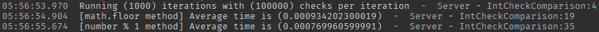

# roblox-int-check-comparison

Comparison of ways to check if a value is an integer.


## References

- [Numbers](https://developer.roblox.com/en-us/articles/Numbers)

## Ways being compared

- The way from Roblox docs which says:
> You can determine if a number is an integer by comparing math.floor(x) == x

- The way using the modulus operator:
```luau
local isInteger = number % 1 == 0
```

## Results

